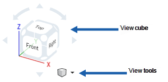
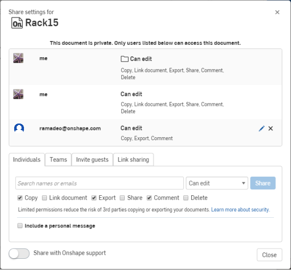

### Onshape Bootcamp A: Part Creation
# Part 1 - Intro to OnShape

## Overview
This tutorial explains the difference between some industry standard CAD tools available and highlights some advantages that OnShape provides.

## Learning Objectives
*   Why OnShape
*   Test computer system performance
*   Create an OnShape Account
*   What is a Part vs Assembly

## Estimated Time
30 minutes

## Why CAD?
Using Computer Aided Design (CAD) software for FRC Teams is essential to planning robot designs and ensuring a successful build season.

*   CAD is used to refine rudimentary sketches, look for problems in the design ahead of time.
*   It helps to explain ideas to teammates visually rather than words. More teammates will understand what is to be built.
*   It takes the guesswork out of measuring, providing exact measurements for where to cut/drill a part.
*   It helps with purchasing of parts by materializing a general design into a clear Bill of Materials.
*   It serves as an assembly guide and reference once the design is finished and construction begins.
*   It serves as a way to make customized metal or plastic parts that can be machined by CNC, router, or 3d printing systems, or ordered from vendors.

## Why OnShape?

Depending on your FRC team, you may have the option of choosing which CAD tool is used. Many teams are fluent in Solidworks, Fusion360, etc and prefer to stick with these tools. If your team is new or looking for a switch, these OnShape bootcamps are for you! At a high level, OnShape provides some advantages over other CAD tools:

*   **MKCAD:** The biggest advantage to using OnShape for FRC is the MKCAD Library. Students can save time using the MKCAD library that includes popular FRC parts. Details for how to use the library of parts is included in this OnShape bootcamp series.
*   **No software install:** Students don’t need to download and install software onto computers, manage licenses, or deal with software updates. OnShape is completely in the browser and supported by major operating systems.
*   **System Performance:** Because OnShape is a hosted CAD platform, many of the calculations are performed on OnShape servers. This means that students can use lower grade computers that are available and reduce the purchasing cost of computers by the school/team.
*   **Collaboration:** OnShape provides sharing and version control. Students can collaborate across multiple documents to build separate robotics assemblies and combine them into a single collaborative robot design.
*   **Education Enterprise:** Schools can purchase an enterprise license for educational purposes.
    *   **Document Organization:** All documents created by students are centralized within the enterprise instead of scattered across many students’ individual accounts. This makes it easier to organize and find documents from current/previous seasons.
    *   **Single Sign On:** The enterprise license will allow students to login with their school-provided email address (Such as a Google account) without remembering a separate password.
    *   **Permissions:** The enterprise setup allows students to be grouped and provided different permission levels based on their tenor/status on the team. Only students added by an administrator can login.
    *   **Analytics:** The analytics tools allow administrators to see student activity and time spent working on documents.

## Preparation Steps

All tutorials in the onshape bootcamps will expect that you have created OnShape account and access to a computer.

1. Check system performance

    It is recommended to use a laptop or desktop computer when using OnShape. If available, use a mouse instead of a trackpad. Check your device performance at[ https://cad.onshape.com/check](https://cad.onshape.com/check).

    Wait until the tests have run and the “Performance check” returns results.

    If the test results are poor, try to use a different device, if possible. Even if this website gives you bad results, try to do the exercise anyways and see if you can get it to work.

2. Create an Account and Login to OnShape

    There are several ways to create an OnShape Account.

*   Check with your team if your school has OnShape Education Enterprise. If so you should get access to from your school/team. Login with the provided credentials or your Single SignOn Account. You will always login with your enterprise domain page like [http://myschool.onshape.com](http://myschool.onshape.com) for enterprise accounts.
*   Create a free education account at [https://www.onshape.com/en/education/](https://www.onshape.com/en/education/) using your school email address. Login at [https://cad.onshape.com/](https://cad.onshape.com/)
*   You can also create a free public account for Makers & Hobbyists [https://www.onshape.com/en/products/free](https://www.onshape.com/en/products/free). All documents created under this type of an account will be publicly accessible, unlike educational accounts.  Login at [https://cad.onshape.com/](https://cad.onshape.com/).

## Onshape Basics
### About Documents
All 3D modeling in Onshape is done within documents. You can create a single document for your entire robot, or break out your robot components into separate documents. You can read more about documents in [OnShape documentation](https://cad.onshape.com/help/Content/introduction.htm?tocpath=Welcome%20to%20Onshape%20Help%7COnshape%20Documents%7C_____0). 

### About Parts and Assemblies

In OnShape there are two main types of objects that you will work with. Parts and Assemblies appear as tabs in the same documented but have two different purposes:

*   A **part** is a single item that is made from sketches and extruding the sketches into a 3d model. You might design custom metal parts to be machined/manufactured by the team or a vendor, such as a custom chassis or an arm/claw. You might also design custom parts to be extruded with plastic using a 3D printer, such as sensor or electrical component brackets/mounts.
*   An **assembly** is the combination of multiple parts into a mechanism. For most FRC teams, you will primarily be inserting parts from MKCAD into assemblies to create robot models. Most teams utilize and purchase parts in MKCAD from popular FRC vendors instead of machining them from scratch.

### Moving Around

It’s important to know all of the ways to move around the 3d space when viewing a part/assembly. The controls sometimes vary between using a Window or Mac computer, and are all described in [Onshape documentation](https://cad.onshape.com/help/Content/moving.htm?tocpath=Welcome%20to%20Onshape%20Help%7CUser%20Interface%20Basics%7C_____2). The most useful view control is the View Cube, which allows moving to different sides of the 3d model with a single click.

### Sharing

You can share documents with others for viewing and collaboration across your team. Use the share button at the top right of the screen to share any document. This [Onshape Documentation](https://cad.onshape.com/help/Content/sharedocuments.htm?tocpath=Sharing%20and%20Collaboration%7C_____1) explains in detail all of the sharing and collaboration features that exist.

### Document Versioning & Branching

OnShape provides versioning of documents that allow for student collaboration. You can break up your robot design into separate documents, one for each component or for each student working on the digital design. Then you can combine all components into a single document by inserting parts & assemblies from the other documents. This OnShape bootcamp will demonstrate this, but all documents will be created by you from scratch.

The most important thing to remember is that you can only insert the latest version of an assembly or part from another document. Always be sure to create a new version when you are ready to share changes with others. Otherwise, you will only be sharing the design that existed when the last version was published. If no version has ever been created, you cannot insert into another document at all.

Document branching is also an important concept in OnShape. A design might evolve in multiple directions, where you might want to create different design options in OnShape. When the idea starts to diverge, you can create a separate branch. You can continue to develop different ideas on different branches in the same document. You will probably end up abandoning one of the branches and continue designing on a single one. Using branching is easier than starting from scratch with each design iteration. It also provides a way to revert back to a point in time and undo work.

You can read more about these features in [OnShape Documentation](https://cad.onshape.com/help/Content/versionmanager.htm).

### Customizing units of measurement

You might find that Onshape documents are created with the undesired unit of measure. You can change the units used in a [workspace](https://cad.onshape.com/help/Content/setdefaultunits.htm?Highlight=unit%20of%20measure) or set your [account preferences](https://cad.onshape.com/help/Content/Primer/setting_preferences.htm?Highlight=preferences) to always create new documents with your preferred units.

### Moving and Rotating Parts

You can move parts in an assembly anywhere in the XYZ space. The “Triad Manipulator” tool appears when left clicking on any part. It has many options on it, allowing you to move the part in the XYZ axis lines using the arrows, in the XYZ planes using the squares, or rotate the part in the XYZ directions using the circles. Right clicking on any of the move control options gives you additional common options such as “Rotate 90 deg” when right clicking on a rotate circle.

To get more familiar with this tool,  read this OnShape documentation if you are unfamiliar with how the tool works [https://cad.onshape.com/help/Content/triad.htm](https://cad.onshape.com/help/Content/triad.htm).

The triad manipulator can be used to freeform move or enter precise distances to move or rotate parts. You can move the part in any direction by left clicking and dragging any of the controls on the triad manipulator. To enter a precise measurement, type into the textbox that appears. Press enter to save the movement after typing it.

8. Be patient

If you are new to 3d modeling and CAD tools, or switching from a different tool, be patient! Learning a new skill takes time, mistakes will be made, and you’ll find that your skills grow over time. It will be easier to design during the build season if you practice and learn ahead of time.