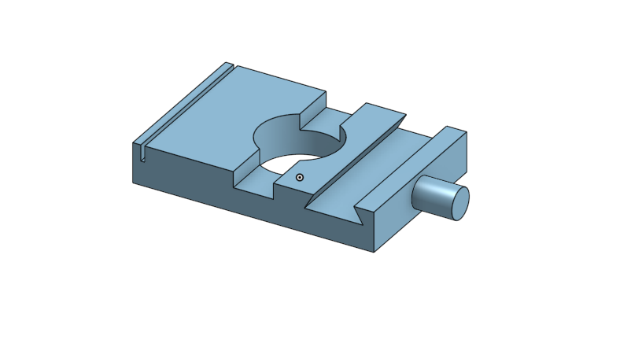

### Onshape Bootcamp A: Part Creation
# Part 2 - Using Sketch and Extrude to Create a Part

## Overview
This tutorial teaches you how to create your first part. Follow the linked YouTube tutorial to create Stretches and Extrude the Sketches into a Part. This part is not FRC specific, but the tutorial will provide you with the basics of creating parts using OnShape tools.

At the end of this tutorial you will create this part using multiple sketches and drawing techniques:

## Learning Objectives
*   Create a sketch
*   Add rectangle and circle shapes
*   Add a measurement constraint
*   Extrude a sketch
*   Create a sketch on an extrusion face
*   Draw lines in a sketch to create a shape
*   Add a degree measurement constraint
*   Add an equal constraint

## Estimated Time
1 hour

## Steps
### 1. Create a Document
On the top left of the website, click the large blue "Create" button and choose "Document...". Name the document with your name. After creating you will be taken to the Onshape Part Studio and you are ready to start CADing!

### 2. Complete YouTube Tutorial
Follow the video tutorial [https://www.youtube.com/watch?v=pMWnsHpDlQE](https://www.youtube.com/watch?v=pMWnsHpDlQE). There are a total of 5 videos in a series and at the end you should have completed a part similar to the overview section. It is recommended that you complete the tutorial by using split screen windows. Put the youtube browser video on one side of your screen and the onshape site on the other, making it easier to follow the video step-by-step.
