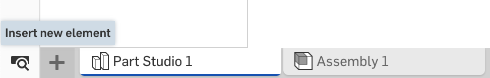
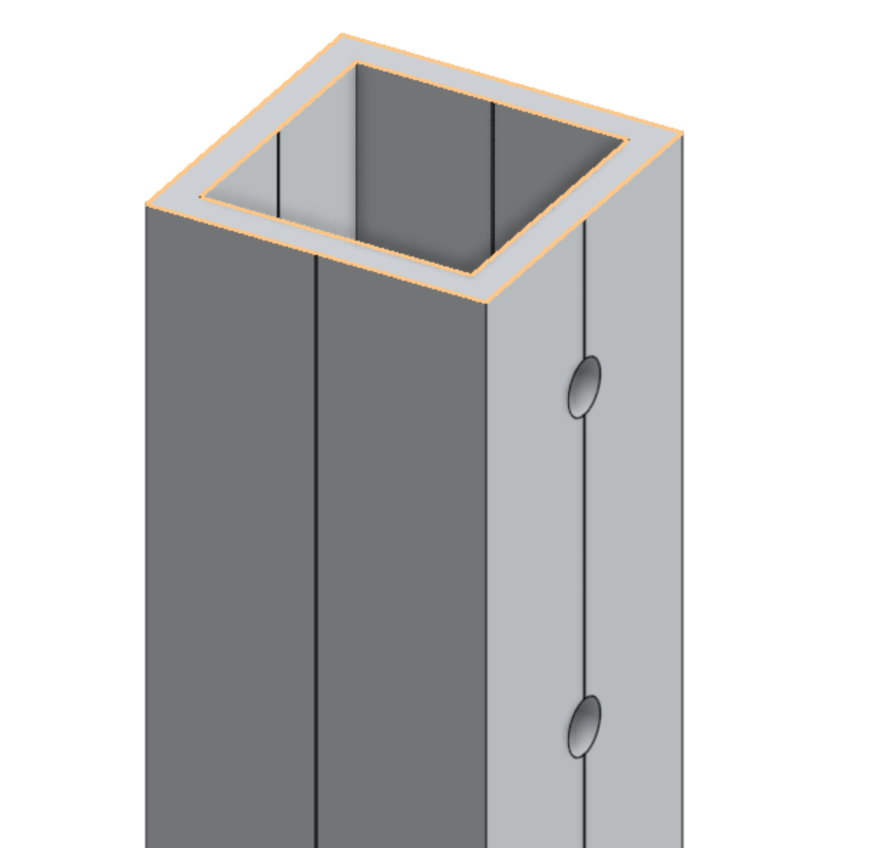
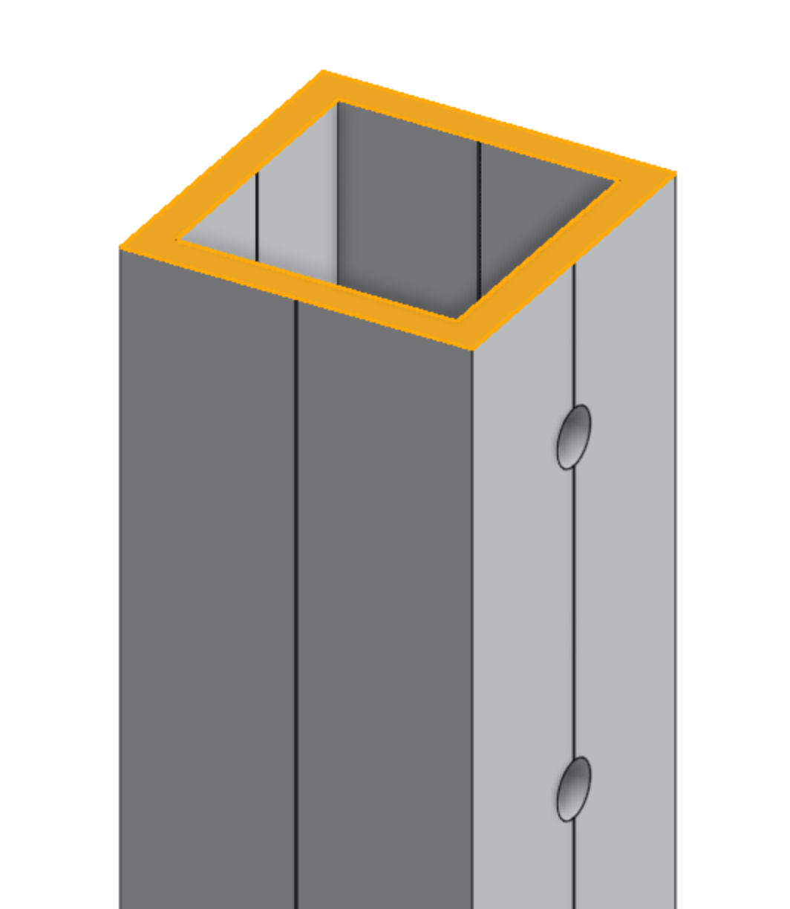

### Onshape Bootcamp A: Part Creation
# Part 3 - Customizing an FRC Part

## Overview

This tutorial teaches you how to import a STEP file provided by an FRC vendor into OnShape and customize it for use on your robot. Preparing customized parts in OnShape allows teams to assemble a fully functional robot in CAD before machining parts in a workshop. This will save  time and money by preparing assembly steps in advance and avoiding mistakes.

In this example, we will use OnShape to drill holes in the exact location required to mount the structural components of an FRC robot. The parts customized in this tutorial are used in future parts on the OnShape bootcamp series. The result will be a 6in tube with 3 custom drilled holes in the side.

## Learning Objectives
*   Locate a STEP file from an FRC vendor
*   Import a STEP file into OnShape
*   Create a sketch on a part’s surface
*   Modify the part using the Extrude tool

## Estimated Time
30 minutes

## Steps
### 1. Locate STEP File
For this particular exercise we will be customizing a Vex Robotics 1" x 1" x 0.100" Pre-Drilled VersaFrame Aluminum Tube. Download the STEP file from the [Vex Robotics product page](https://www.vexrobotics.com/versaframestock.html). Make sure to download the correct part, this specific part number is 217-4104.

### 2. Create a Document
Create a new OnShape document named “Customized Robot Parts”. You will need to reference these parts in later tutorials of the onshape bootcamp.

### 3. Import STEP File
To import a part from a STEP file, find the “Insert a new element” button that is shown as a “+” located to the left of the part/assembly tabs in Onshape.

Then click on “Import…”

Select the STEP file you downloaded earlier from the file dialog

**Note:** Make sure the downloaded file has the .step file extension on it. If a file is imported into OnShape accidentally without this extension it will not be translated into an OnShape part, and instead will exist as just an uploaded file. If the incorrect or no file extension is used, you will not see the Import dialog that is shown in the next few steps.

Onshape will then prompt you with some import options, which we will just use the default options.

**Note**: Sometimes you may want to customize these options, especially using the “Orient imported models with Y Axis Up” option to make sure parts get imported facing the correct direction. For example, the AndyMark Chassis will get imported facing 90 degrees up if this option is not used.

Click “OK” to import the part. You will see a notification when the part has finished uploading and when the conversion process has completed. The part should now show up as a tab in the document as well as in the Parts list. To open the parts, if not already open, list click on the Tab Manager control in the bottom left corner.

### 4. Shorten a Part
The VersaFrame Tube comes in 59in lengths. Let’s shorten it to 6in. Open the Part studio of the 1x1 Tube by double clicking on it in the part list or selecting the part tab at the bottom of the window. Zoom into the top of the part and hover over the top surface as shown. Click on the top edge to select it.

Select the extrude tool from the toolbar.

By default the extrude tool will add a 1in extension to the part.

Change the options in the tool to instead remove 53in of the part. Click on “Remove” instead of Add and for “Depth” type “59-6”, allowing Onshape to automatically trim the part to have 6in remaining (Removing 59-6in = 53in, leaving 6in of the original 59in part).

### 5. Sketch onto a Part
Let’s proceed with adding 3 screw holes at the top of the sides that don’t contain predrilled holes. We first need to sketch what should be altered. Click on the Create Sketch button.

Then select the face of the part not containing. Onshape will highlight the half of the side of the VersaFrame (either side is fine to use).

Next, add 3 centerpoint circles to the sketch that will be turned into holes. These circles will be positioned to the same location as the holes on the other sides.

You will need to zoom in very closely in order to properly place the centerpoint of the circle. You will notice that the sides of the VersaFrame tube have an piloting notch to ensure that holes are drilled in the exact center. It’s important to select the center line of this notch, otherwise the screw holes will not be aligned properly.

Next, select the center point circle tool.

Hover over the centerline of the notch until a dashed yellow line appears. This indicates that the point will be added onto the center line and the circle will be centered on the part.

Click to add the center point, move the mouse to increase the circle size and then click again when the size is about .05in.

Next, use the dimension tool to set the distance of the centerpoint of the circle from the top of the tube to .5in. First point of the centerline of the notch at the top of the tube:

And then select the centerpoint of the circle. A dimension indicator will appear.

Click on the measurement number and set the distance to .5in. This should align the circle to the first predrilled hole. Next, provide a dimension for the circle. Click on the dimension tool again, select the blue rim of the circle, followed by anywhere within the circle, a dimension of the diameter will appear. Type .164in to set the diameter equal to the predrilled holes.

Repeat this process two more times, so that you have 2 identical circles spaced apart. Between the holes, use a 1in measurement between the circle centerpoints, instead of the .5in used between the first circle and the top of the tube. Doing this should result in a sketch that looks like the following, where the circles look the same as the predrilled holes. Click the green confirmation button to save the sketch.

### 6. Remove from Part using Sketch
Next you will create holes in the tube. Select the Extrude tool and choose the Remove option.	Select the 6 half circles in the sketch. Onshape will break up the circles into half circles due to the notch in the part. Onshape automatically sets the Depth to 1in which should result in the holes appearing on both sides of the tube.

Click the green confirmation button to save the part.

### 7. Customize Part Name
Let’s give the part a useful name so that it’s easier to understand what the part is later. The name will appear for the part when using the insert dialog in our robot assembly later. We will edit the name in both the Parts pane and the Part Studio tab at the bottom of the screen.

First rename the tab by right-clicking on it, and choosing Rename

Type the name “6in 1x1 with 3 side holes” and press enter. Then in the Part pane on the left, also rename the part with the same name by using the same menu option. In OnShape you can have multiple parts in the same part studio, which we don’t have here, hence the ability to have a Part Studio level name and Part level name.

### 8. Create a Version
In order to use the part in other documents, you must publish a version. Click on the create version button on the left side of the screen.

A dialog box will appear. The first version by default will be “V1” and the rest of the information is optional. In this case, leave the defaults, and click Create.

You now have modified your first part from an FRC vendor step file and made it available to other documents!
