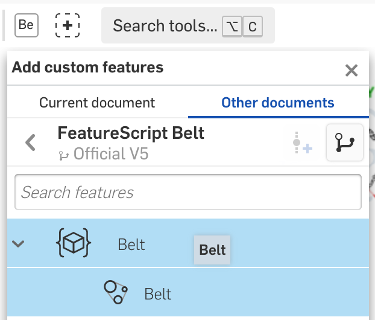
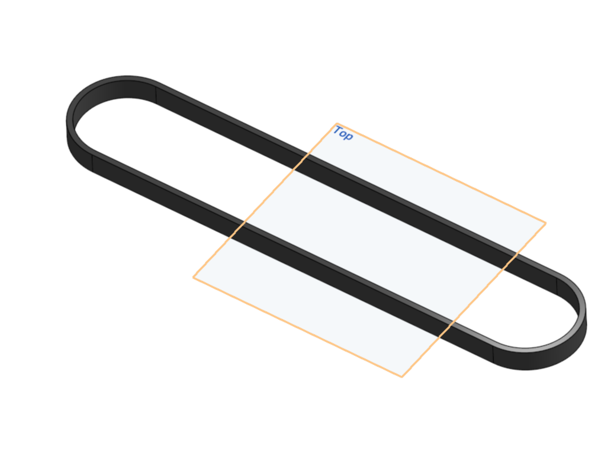

### Onshape Bootcamp A: Part Creation
# Part 4 - Creating Custom Tubes, Belts, and Chain

## Overview
This onshape tutorial teaches you how to create customized parts from scratch for use on an FRC robot. Specifically we will be making a PVC tube with custom holes, a polycord belt loop, a timing belt loop with 15mm thickness, and a “chain” loop. The belt loops are created using the Belt FeatureScript functionality in OnShape and are used to demonstrate the functionality of a robot mechanism, even though they don’t provide the exact appearance of the real part.

## Learning Objectives
*   Create a 1in PVC tube with custom drilled holes.
*   Create custom sized belt / chain using the Belt Feature Script
*   Edit Part Appearance

## Estimated Time
1 hour

## Steps
### 1. Open Document
Open the documented “Customized Robot Parts” you created in earlier bootcamps. You will add additional parts to this document that are then used to complete the final robot assembly that is guided across all bootcamps.

### 2. Create PVC Tube Part Studio
Use the “Insert new element” button to add a new part studio. Name it “1in PVC 34.25in Long”.

### 3. Draw Sketch
Using the knowledge that you have learned in previous lessons, create a 34.25in by 1in long rectangle. Draw a line through the midpoint of the rectangle, lengthwise, so that you have a long rectangle with a long line passing through the center.

Insert 4x circles with center points on the midpoint line. Set each circle with .163in diameters where, the centers are distanced from one edge of the rectangle using the following distances. This will result in two circles near one end and two near the other end of the PVC.

<table>
  <tr>
   <td>
Circle 1
   </td>
   <td>2in
   </td>
  </tr>
  <tr>
   <td>Circle 2
   </td>
   <td>3.45in
   </td>
  </tr>
  <tr>
   <td>Circle 3
   </td>
   <td>31.154in
   </td>
  </tr>
  <tr>
   <td>Circle 4
   </td>
   <td>32.604in
   </td>
  </tr>
</table>

Next add a line inside of the rectangle that is drawn lengthwise across the tube. Space it .140in away from one of the long edges.

Save the Sketch.

### 4. Revolve Tube
Next we will use the Revolve tool to create a PVC tube. Select it from the top menu.

Select the smaller rectangle that is drawn with the .140in line as the face to revolve.

Next, click on the red “Revolve axis” box. Then select the midpoint line as the revolve axis. If selected correctly, a hollow tube should be drawn as a preview.

Save the Revolve by clicking the green box.

### 5. Extrude to Add Screw Holes
Next add the screw holes to the tube. First you will need to click on the eye button next to Sketch 1 in order to show the sketch again after it was hidden by the Revolve operation.

Next, click on the Extrude button. In order to select the circles for extrusion inside of the tube, right click on the Revolve feature and click “Suppress”. This will temporarily hide it so that you can select the circles inside.

Select all of the circles to add them to the Extrude. Change the Extrude operation to “Solid” -> “Remove”. Also, change the extrude option “Blind” to “Symmetric” so that the tubes extend through both sides of the circles symmetrically. Lastly, check the “Merge with all” option.

If you have done the extrusion with these settings, your preview should look as follows. There should be 4 red tubes where the screw holes are. The errors will go away once we show the include the revolve again.

Without exiting the Extrude operation, right click on the Revolve again and click “Unsuppress”. You should then see a preview of the tube with all holes “drilled” through on both sides of the tube.

Save the Extrude to complete the part.

### 6. Edit Part Appearance

You can customize the appearance of any part to make it match the parts color and transparency, instead of using the color automatically assigned by onshape. Right click on “Part 1” in the part pane and click “Edit Appearance...”.

Assign the part the lightest gray color option as shown below

### 7. Create PolyCord Part Studio
Create a new Part Studio and name it “30.45in PolyCord Loop”.

### 8. Sketch 2 Circles with Spacing
Create a Sketch, insert two circles that are horizontally aligned. To horizontally align the 2nd circle, first hover over the 1st circle center point so that a horizontal indicator is shown when creating the 2nd circle, as shown below.

Once the square appears, drag the mouse to the right to create a horizontal line and then click to place the 2nd circle.

Give both circles a .75in diameter. Then space the circle centers 30.45in apart. Your sketch should then look as follows.

Save the Sketch.

### 9. Extrude 2 Circles
Next, extrude both circles by .25in into a cylinder. Save the extrude operation.

### 10. Add Belt Feature Script
Custom Tools are built into OnShape using Feature Script. Feature Script allows for additional functionality that is not available in OnShape’s standard tools (extrude, revolve, etc). Belts are an example of using Feature Script to create parts. The Belt functionality will create a solid ring part around the cylinders we extruded.

First, add the Belt Feature Script to your workspace. Click on the “Add custom features” button in the top tray.

Then filter the results by “FeatureScript samples”.

Then Search for Belt. Select the “FeatureScript Belt” document and as a final step, select “Belt”. This should add a “Be” icon to your custom features tray so that i can be easily accessed in the future.

Click the “X” in the “Add custom features” box to close it.

### 11. Create PolyCord Belt
Now, click on the “Be” button to create a belt. For the “Pulley Faces”, select both the faces of both cylinders. Then set the thickness and width to .25in.

Use the “Select Mate connector” tool to the right of the “Mid-plane box”. Select the center point mate on one of the cylinders so that the belt is created in the center.

Once the mate is selected, the belt should appear as shown below.

Save the belt.

### 12. Cleanup Parts
The cylinders aren’t needed in the final part and can be deleted. Deleting after the belt is created cleans up the part when inserted into other documents. Otherwise the cylinder parts will show as insertable.

Select the cylinders which should be “Part 1” and “Part 2” in the part tray, right click on them and choose delete.

Click ok on the dialog box to delete the parts.

### 13. Edit Part Appearance
We will make the polycord clear based on the equivalent part by McMaster-Carr ([https://www.mcmaster.com/6567K2/](https://www.mcmaster.com/6567K2/)). Open the Edit Appearance dialog and change the color to light gray with a 25% transparency.

### 14. Create Ramp “Chain” Part Studio
Adding fine details, such as chain link loops, usually isn’t necessary until you build your real robot. However it is useful to connect parts with a loop part to visualize the robot construction and how parts are powered by motors. In addition you may also want to use CAD software to predict the estimated amount of chain. Similar to the PolyCord loop, we’ll create a chain loop that can be attached to sprockets.

First create a new part studio and name it “Ramp Chain”.

### 15. Sketch Circles
Using the same technique as creating the PolyCord belt, create a similar sketch with two circles that are horizontal to each other. The circles should be 1.25in in diameter and the center points of the circles should be spaced 9.2in apart.

Save the sketch.

### 16. Extrude Circles

Extrude the circles by .463in.

### 17. Create Belt
Use the Belt Feature Script again to create a chain loop. Use .463in width and .352in thickness. These dimensions come from the roller chain specs for Vex Robotics #35 chain (part 217-2776) [https://www.vexrobotics.com/roller-chain.html](https://www.vexrobotics.com/roller-chain.html).

### 18. Cleanup Parts
Again, you can delete the cylinder parts in order to hide them from other documents.

### 19. Edit Part Appearance
Give your chain a grey color.

### 20. Create Intake Roller Belt Loop
Let’s create yet another belt to represent a 15mm timing belt similar to the AndyMark timing belts [https://www.andymark.com/products/15mm-wide-5mm-htd-timing-belts](https://www.andymark.com/products/15mm-wide-5mm-htd-timing-belts). The same belt creation process is used.

1. Create a new part studio named “Intake Roller Belt”.
2. Create a sketch with two horizontally aligned circles with 2.5in diameters
3. Space the centerpoints of the circles 11.5in apart.
4. Extrude the circles into cylinders by 15 mm.
5. Use the Belt FeatureScript to create a belt with 15mm width and .15in thickness.
6. Delete cylinder parts.
7. Give the belt a dark grey / black color.

Following these steps should result in a belt as shown below.

