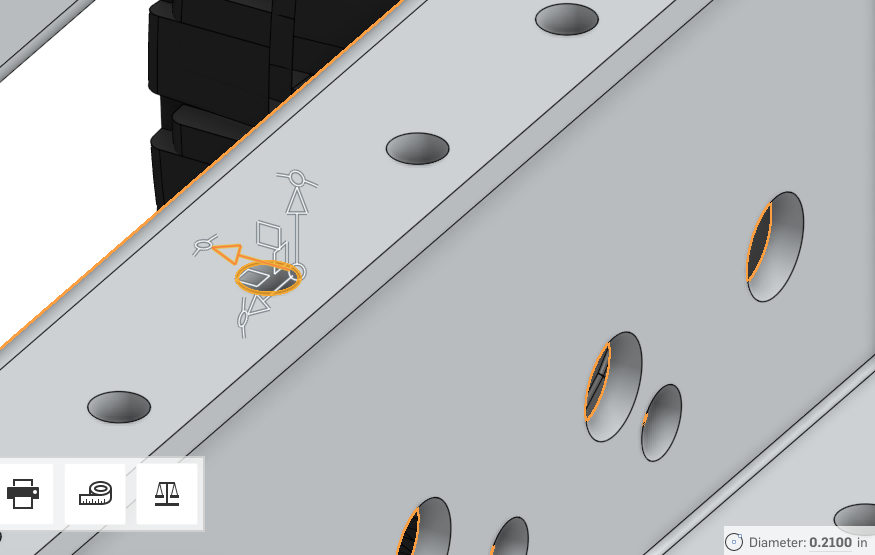
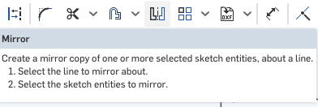
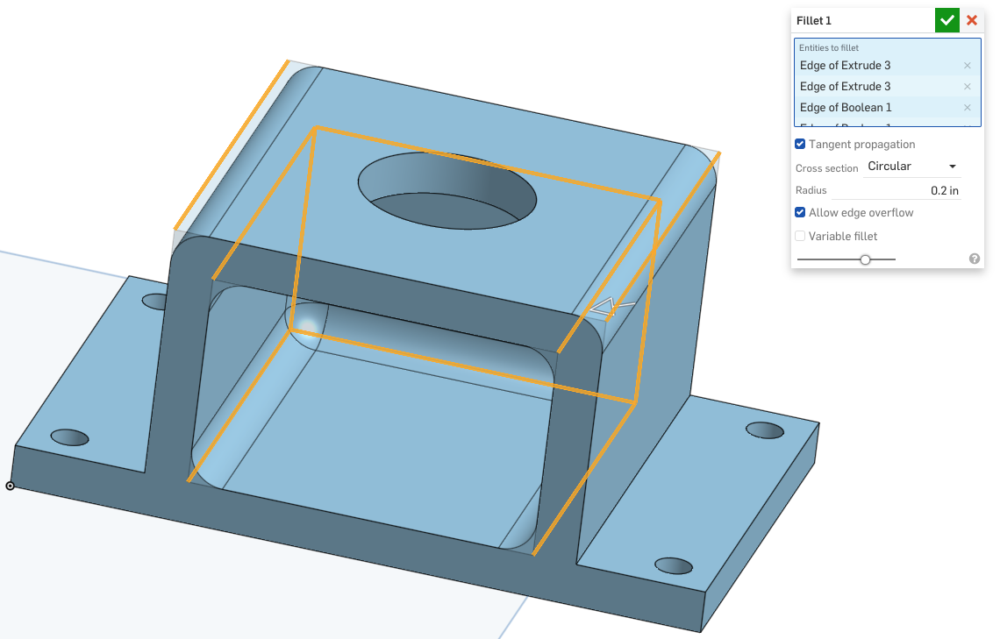

### Onshape Bootcamp A: Part Creation
# Part 5 - Creating a Robot Signal Light (RSL) Mount

## Overview
This section of the part creation bootcamp will guide you through designing a Robot Signal Light (RSL) mount in OnShape. The design is made specifically to be 3d printed. It assumes that you have followed previous bootcamps and understand OnShape basics (including sketches and extrusion). A design that mounts onto the sides of an AndyMark chassis is provided in this tutorial, made with .25in thick plastic so that it’s durable for competition. You can use this tutorial as an inspiration to make an RSL mount or other 3d printed components specific to FRC (For example camera/sensor mounts, electrical component supports, mounts, and organizers).

**Note:** The design has not been tested during any FRC competition or installed physically on a robot, due to COVID-19.

## Learning Objectives
*   Searching for documents
*   Measure distances of an FRC Part in OnShape
*   Mirroring sketch entities
*   Using Booleans to merge parts
*   Using Fillets to strengthen parts

## Estimated Time
1 hour

## Steps
### 1. Search For and Open MKCad Documents
MKCad will be introduced in the assemblies portion of this bootcamp. You will learn extensively about it later. For now, know that MKCad is a library of standard and commonly used FRC parts. We are going to look at a few parts in this bootcamp: The Robot Signal Light (RSL) and the standard Kit of Parts Chassis, provided by AndyMark. We will use the digital representation of parts order to measure the correct hole placement and size in order to make a 3d-printed part that fits correctly.

First, do the document listing page [https://cad.onshape.com/documents](https://cad.onshape.com/documents). Click on the “Public” option on the left side, and then in the search box, search for “MKCad - Electronics”. You should see a list of document search results returned.

Note that there are multiple copies of this document. Use the one that has the most “Links” listed and doesn’t have “Copy” in its name. This is usually the official MKCad document.

Click on the document name to open it. You will be viewing the document with read-only permissions. You can view and measure anything in the document but you cannot edit it.

### 2. Measure Robot Signal Light
After opening the “MKCad - Electronics” document, You should see a list of parts on the left side of the document screen. Scroll to find the Robot Signal Light document.

Double click on the RSL part to open it. Rotate the part to be able to select the bottom of the light. Select the circle as shown below in order to measure it. Note the diameter of the circle that is shown the bottom right corner of the screen.

The diameter of the RSL threaded rod that is used for mounting is .885in. It’s best to add a gap between the 3d printed part and the light, so let’s say that we’ll 1in so there is a small gap between the mount and the RSL: (1in - .885in)/2 leaves a .0575in circular gap around the light. If you 3d print a part with exactly a .885in hole, the part would have a tight fit, you could break a part if using excessive force, and it will likely require sanding to fit.

**Note:** You can click on the measurement to copy it and see more exact measure (unrounded). Click on .885in to see it expand to 0.885000in, if the part was not exactly .885in diameter, you would see a more exact measurement here.

**Note:** If you plan on making your own mount from scratch, you should measure additional parts of the RSL: the max diameter of the light (1.770in), the length of the threaded rod of the light (.922in).

### 3. Measure AndyMark Chassis
Search for and open the “MKCad - KOP Chassis (Configurable)” document. Open the “Long Chassis” assembly and zoom into one of the 4 locations of the robot between two wheels, as shown below.

Lets measure a few things, starting with the diameter of a screw hole on the top of the aluminum chassis. Select one of the screw holes to measure it and note the diameter of .21in.

Now select the screw hole next to it, while keeping the other hole selected. The distance between holes (centerpoint of each circle) should be shown as 1in.

Press the escape key to clear the selections. Now select two of the screw holes parallel to each other on each side of the aluminum frame, as shown below. The distance should be shown as 3.5in.

Let’s also note the gap between the screw hole and outer edge of the chassis. Select one of the screw holes and then the line on the top edge of the outer aluminum frame, as shown below. The distance between the edge of the screw hole and edge of frame should be listed at .145in.

In summary, we have noted the measurements of the following:

<table>
  <tr>
   <td>Diameter of screw holes on top of chassis
   </td>
   <td>.21in
   </td>
  </tr>
  <tr>
   <td>Centerpoint distance of holes on same side of chassis
   </td>
   <td>1in
   </td>
  </tr>
  <tr>
   <td>Centerpoint distance of parallel holes between the two sides of the aluminum frame
   </td>
   <td>3.5in
   </td>
  </tr>
  <tr>
   <td>Distance between edge of screw hole and edge of frame on the outer aluminum frame
   </td>
   <td>.145in
   </td>
  </tr>
</table>

We will use these measurements in a sketch to create an RSL mount that is mounted to 4 holes on the chassis frame.

### 4. Create a Document
Create a new OnShape document named “RSL Mounts”. Within it, create a Part Studio named “AndyMark Chassis Mount”.

### 5. Sketch the AndyMark Chassis Mount
Open the “AndyMark Chassis Mount” Part Studio and create a sketch. Create a rectangle measuring 2in by 2.5in. Then create a rectangle within it measuring 1in by .25in. Use the following as a guide for the rectangle layout.

Then create another rectangle connected to the 1in by .25in as shown below. Make the width .25in. The length should already be 2.5in because it should be connected to the outer edge of the largest rectangle.

Next, create two circles of diameter .21in (matching the chassis screw hole diameter). Position the edge of the circles .145in from the left edge of the largest rectangle. This should match our measurement taken earlier. It’s important to select the edge of the circle and not the center point of the circle when using the dimension tool, otherwise the part won’t fit correctly on the robot.

Now distance the centerpoint of each circle .25in from the top or bottom of the rectangle (one circle on the top and one on the bottom). It’s important to use the dimension tool with the centerpoint of the circle and not the edge.

This should now result in a sketch where there are two circles spaced 2in apart from their centerpoints. The part when extruded will also have a .145in distance that will sit flush with the chassis and not interfere with bumper attachment.

At this point, you have created ½ of the part sketch. Next we will use the mirror tool to duplicate the sketch parts you have already created automatically build the 2nd half of the mount. First, select the mirror tool in the toolbar.

First, select the right most line of the largest rectangle to use as the mirror line. After selecting the line should turn green.

Now select all of the sketch entities to mirror them. You can click and drag your mouse to create a selection rectangle to easily select all entities. Click outside of all sketch parts in the top left corner and drag to the bottom right corner. Let go of the mouse button and all entities will be selected. Once that is done you should see a completed bottom sketch as shown below.

Save the sketch.

Next, use the extrude tool to create a bottom base for the mount. Select the faces as shown below and extrude them .25in.

Next, extrude the walls of the part as shown below by 1.5in. You will need to show the sketch in order to extrude again. Click the eye button next to Sketch 1.

Let’s sketch on top of the part to create a roof. Click the new sketch button and select the top face of the wall to create a sketch at that level.

Then, create a rectangle that covers the entire top of the walls as shown below.

Then add a circle that is centered both horizontally and vertically. As mentioned in previous bootcamps, hover over the center of both lines on the part (you can see the midpoints below) and OnShape will automatically guide you to center the circle.

Next, extrude the sketch so that a roof is created and the 1in hole where the RSL will be mounted is left un-extruded.

We want all of the parts to be combined so that when exported, it becomes a single file to be 3d-printed. We also want to combine so that the Fillet tool we use later works properly. Select the boolean tool to do this.

Select all 4 parts to combine into one and save the boolean operation.

The parts tray should now just show a single part, and the different colors between the parts should disappear and become a uniform color.

Next, use the fillet tool to round the edges. Using rounded edges not only strengthens the part (increases tensile strength) but also makes the part safer (less sharp edges). Select the fillet tool in the top toolbar.

Select the edges as shown below. You will need to zoom and rotate to select all edges. Don’t forget to also select the lines inside the part too. These specific lines are chosen so that the part is still flat when 3d printed.

Next, set a fillet radius of .2in and save the fillet.

You have now completed the RST mounted part. Here is what it will look like when mated to the AndyMark chassis.

To 3d print it, place the part with the open side facing up in your printer’s slicer program. For example:

