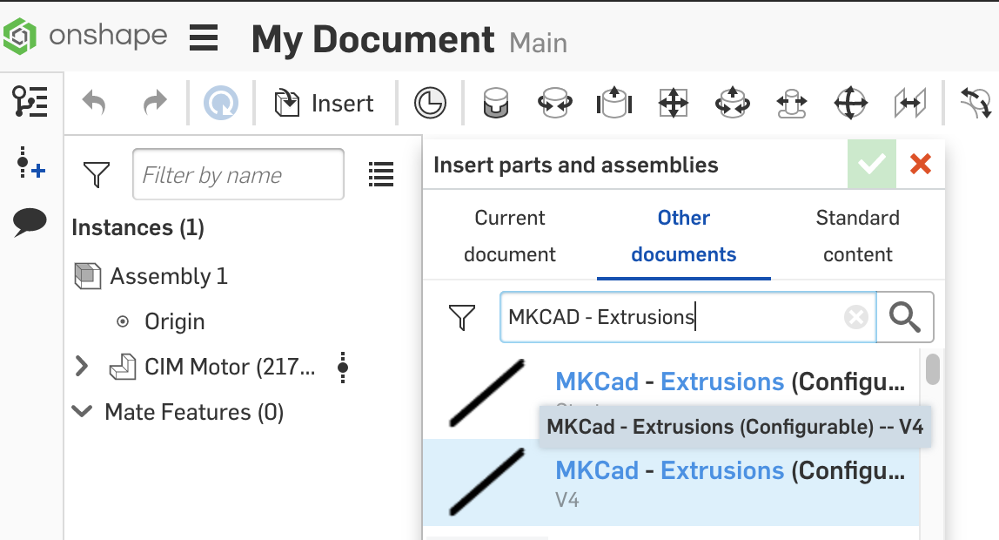

### Onshape Bootcamp B: Robotics Assemblies
# Part 1 - Using MKCAD

## Overview
This tutorial teaches you how to use the MKCAD library of parts in OnShape. At the end of the tutorial you will have inserted a CIM Motor and a 14in VersaFrame Tube as show here:

MKCad was created by Marcus Bernstein of FRC#1836: The Milkenknights, as announced on [Chief Delphi](https://www.chiefdelphi.com/t/pic-introducing-mkcad-the-onshape-frc-parts-library/161295). It is continuously improved each year by a group of volunteers and the ongoing work is managed by the team in [Trello](https://trello.com/b/6fHc37vK/mkcad-improvements).

MKCAD contains the most comprehensive set of parts from commonly used vendors to build FRC style robots. Using the library saves time by eliminating the need to locate the STEP file on a vendor’s website, download it, and import it into OnShape. Many of the MKCAD parts have been optimized for use in Onshape so that parts stay together when moved. Some Parts also include configuration options that allow the changing lengths and other part options as your design evolves.

The alternative to using MKCAD is for teams to build their own library of parts from STEP files, which some teams decide to do, especially if using OnShape Education Enterprise to share documents within the team. 

Importing STEP files will still occasionally be required. MKCAD will generate a locked part that cannot be modified with customization, say with specific screw holes added. If a custom machined part is required, it’s best to import from a STEP file.

## Learning Objectives
*   Locating MKCAD
*   Understanding MKCAD Document Organization
*   Inserting parts from MKCAD
*   Changing a Part’s Configuration

## Estimated Time
30 minutes

## Steps
MKCAD is a series of OnShape documents that are available in the Public document search results. Unfortunately the only way to find and use MKCAD parts is to repetitively follow these steps to insert a part from a public document. Sometimes the search is slow and unfortunately there isn’t a way to “bookmark” commonly used documents and parts.

### 1. Create Document & Switch to Assembly 
Create an onshape document using the Create dropdown

In the bottom nav, you will see that your new document contains two tabs “Part Studio 1” and “Assembly 1”.

In this tutorial we are only using assemblies. You cannot use the part “Insert” tool on Part Studios, only on Assemblies. Click on the Assembly 1 tab to switch to the assembly.

### 2. Find an MKCAD Document & Part

Click on the “Insert…” button to open the part insert dialog.

By default, the insert dialog will show a list of parts that can be inserted from the Current Document. We will always want to switch to Other Documents and click on the Public option.

By Default, OnShape will show a list of recently created public parts. Instead type “MKCAD” into the search box to show the list of MKCAD part documents.

### 3. Insert an MKCAD Part
Lets insert a CIM Motor. Scroll down and find the “MKCad - Motors” document.

If you can’t find it you can refine the search to “MKCad - Motors”. Note that many users have created copies of MKCAD. It’s recommended to use the main document, without the “Copy” at the end. This is usually also indicated by having a version number, because most copies have only one version and say “Start” as the version.

Click on the “MKCAD - Motors” document to see a list of available parts. In list of parts, find “CIM Motor”

Click on the CIM Motor and move your cursor to the open space to the right. A preview of where the part will be placed is loaded.

Click to place the part. And then click the green checkbox in the Insert dialog to confirm the part insertion.

You have now inserted your first part using MKCAD!

### 4. Insert a Configurable MKCAD Part
Let’s proceed by inserting a configurable part. Follow the same procedure to find the “MKCad - Extrusions” document.

Click on the correct “MKCAD - Extrusions” document to open it. Let’s insert a Tube part, which is generally used as a structural component. Click on the arrow to the left of the “Aluminum VersaFrame Tube (Configurable)” Part to expand the configuration options. Using the configuration options, make a 12in 1” X 2” X .100” with a 1in hole offset as shown below:

Click the “Generate” button to create the part with the chosen configuration options. After some processing time, the part will appear below the Generate button with the name “Aluminum VersaFrame Tube”. Click on it to insert into the assembly.

Click on the green checkbox to confirm part insertion. You should now have a 12in VersaFrame Tube along with a CIM motor in your assembly.

### 5. Changing Configuration of a Part
Configuration options can be changed after the part has been inserted. Lets try this now by changing the VersaFrame Tube. In the part list pane on the left side of the window, right click on the VersaFrame Tube part and select “Change configuration...”

Let’s change the Tube to be 14in long and have .5in spaced holes. Enter the new settings into the configuration panel and click “Generate”. A new part is generated and the preview of the part will appear in the assembly, replacing the existing part.

Click the green checkbox to confirm the configuration change. Your document should look as follows with an inserted CIM motor and reconfigured Aluminum Tube.

