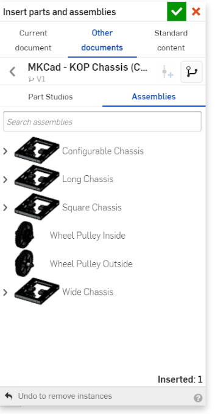
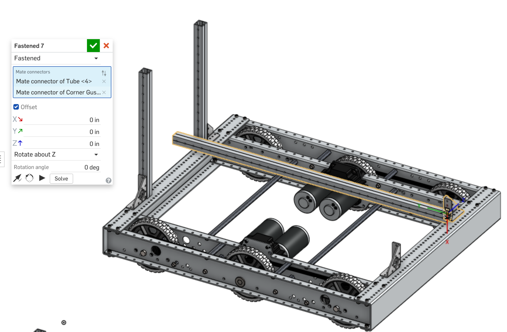

### Onshape Bootcamp B: Robotics Assemblies
# Part 2 - Create a Chassis & Support Assembly

## Overview
This tutorial teaches you how to construct a robot assembly in OnShape using standard FIRST Robotics Competition parts including the AndyMark Kit of Parts (KoP) Chassis and Vex Pro structural components. It utilizes the MKCad instead of importing your own STEP files into OnShape.

It assumes that you have already created your OnShape account and followed previous bootcamps about Onshape Basics and MKCad.

At the end of this tutorial you will have built a robot with a ramp support structure. The design was adapted from Team 7272 Envirobots 2020-2021 Competition robot, which carried power cells into the lower power port.

**Note:** Some of the images and parts shown in screenshots might not exactly match yours when following step by step. Because MKCad is constantly improved, part names, colors, etc might change. It’s also worth noting that this tutorial was originally written using Team 7272 Envirobots part library in Education Enterprise. It was adapted to use MKCad for use by other teams.

## Learning Objectives
*   Insert a parts from MKCAD library
*   Insert multiple parts at once
*   Move around an assembly
*   Mate a part using Fastend Mate
*   Mate a part with an offset
*   Change an existing Mate

## Steps
### 1. Create a Document
Create a document named “2020 Robot” in OnShape.

### 2. Navigate to your Robot Assembly
In the bottom nav, you will see that your new document contains two tabs “Part Studio 1” and “Assembly 1”.

At this point, delete Part Studio 1 by right clicking on it and choosing “Delete”. Also rename Assembly 1 by right clicking on it and choosing “Rename”. Type “Robot” and hit “Enter” to save it.

### 3. Insert AndyMark Chassis
Insert the AndyMark Chassis from MKCAD. Search for “MKCad - KOP Chassis” in public documents. Use the long chassis option listed under Assemblies. Don’t change any configuration options. If you are not familiar with insert parts/assemblies or using MKCAD, see the previous tutorial.

### 4. **TODO** Insert AndyMark Chassis (Low Resolution)
If at this point, your computer is having trouble rendering the chassis, you will want to switch to the low resolution version of the chassis. If you are able to move around the chassis with no issues, proceed to the next step.

Delete the “AM14U4 Long” assembly from the left tray and insert the low resolution version of the chassis instead. 
Creating this in MKCad is pending discussion on https://www.chiefdelphi.com/t/mkcad-2021-requests-and-updates/390651/65?u=comppro2008

### 5. Insert 4 Corner Gussets
You are about to insert 4 Vex corner gussets from MKCad into your robot assembly. Search for “MKCad - Versa” and look for the “Versaframe Corner Gusset”.

You will insert 4 parts at once before clicking the green checkbox. Click on the part in the library once, then move your mouse around to place the part in a specific location. After clicking to place the part, you can click on“Versaframe Corner Gusset” again to add an additional part. Click to place the gusset 4 times until you have corner gussets in all 4 locations. Inserting parts this way saves time reducing the number of times you have to search for public parts. 

### 6. Mate Front Gussets to Chassis
The “Mate” tools in onshape align parts together. In this step we will tell Onshape to perfectly align the screw holes in the Corner Gusset to the chassis. Locate the Fastened Mate tool in the top toolbar.

Click on the Fastened Mate tool, and then zoom in (by scrolling with your mouse) to one of the front gussets. When hovering over the part, you will see that onshape automatically adds guides to select the screw holes. Click on the hole closest to the right.

Next, zoom out and zoom in near the front of the robot chassis. Click on the 4th screw hole of the inner row of holes to position the part, shown below. Your version of the chassis might not have the screws shown in this picture, but it is still the 4th whole where the inner side and front of the chassis are connected.

After clicking on the hole of the chassis, the preview should update to show the parts mated together. 

**Note:** You will likely need to use the **Flip** (the large arrow icon) or **Reorient** (the circular arrow) tools to position the part correctly so that the part is positioned like the following.

Click the green arrow.

**Note: The order of selection matters when you mate parts.** The part that is selected first will move to be joined with the 2nd part. So it’s important to always select the chassis as the 2nd part. If you select holes on the chassis first, then the chassis will move towards the gusset. You usually want to keep your chassis at the origin, because it is slower to process moving. You can always undo the incorrect mate by pressing the escape key, or by deleting the mate in the left tray if it’s already created.

Then do the same mate procedure to the 2nd front gusset on the other side. You may notice that the part might not be oriented 100% the same as the other side, with the faces reversed. Technically you could choose the screw hole on the other side of the part to make it match (requires you to rotate your view to select the other side). However the difference in orientation does not affect the dimensions of the robot design and can be fitted to the robot correctly when building for real.

### 7. Mate Back Gussets to Chassis
Following the same Fastened Mate procedure as the front gussets, do the same for the back, however the screw holes used should be the 2nd screw not the 4th.

### 8. Insert versaframe tubes
Next you will insert 4 versaframe tubes. Search for “MKCad - Extrusions”. Use the 1” x 1” x 0.100” Option with .5in hole offset. Insert two 15in tubes at the back of the robot and two 33in tubes at the front.

### 9. Mate back tubes
Use the Fastened mate tool again, selecting the bottom hole of the 1x1 15in tube and then the 1st hole of the corner bracket. This will make the tube perfectly perpendicular to the chassis and sitting flat on it. Again, you will probably need to use the Flip and Reorient tools to get the position shown here.

Do the same to the tube on the other side of the back and the robot should look like the following.

### 10. Mate front tubes at an angle
The next fastened mate will be at an angle to achieve a ramp. Mate the 1st hole of the tube to the **2nd hole **of the corner gusset. Before proceeding you will want to adjust your orientation of the mate so that the tube is sitting parallel to the chassis as shown below (use the reorient button). Otherwise the angle offset numbers mentioned below will need to be adjusted (+/- 90 degrees).

Now, instead of completing the mate, first check the “Offset” box. Many options will be displayed. For this mate, you want to select “Rotate about Z” and enter “25” into the rotation angle box. This will mate the tube at a 25º angle. The preview will show the tube angled with the back and front tubes meeting.

Note that angles sometimes have to be entered negative. This is due to how the part is oriented in the XYZ space. The preview helps to show you the direction the part is going, and if it’s moving in the wrong direction, make the degree value negative.

Next, mate the 2nd tube using the same process and z angle offset.

### 11. Correcting/Changing a Mate
We purposely make a mistake in the back of the robot to demonstrate how mates can be changed after they are created. The corner brackets in the back are supposed to be mated in the interior row of screw holes, not the exterior. If you click on a mate in the left tray, it shows you where the mate is located with highlighting. In this tutorial, the mates to edit should be Fastened 3 and Fastened 4:

You can edit any mate by double clicking on them in the left tray. Double click on Fastened 3 now to edit it.

Next, if you look at the mate tray, you will see a list of two mate selectors. You can remove the 2nd mate connector using the delete “X” button.

Then, select the new & correct hole on the chassis to change the mate.

After selecting the new hole, the mate should automatically move the part. And if you click the “Solve” button, the other connected parts will move along with the part being mated.

Do the same mate correction to the other side (Fastened 4) and then you will see that the vertical and ramp supports should now perfectly meet at the top screw holes.

### 12. Add T Gussets
Let’s build the 2nd level to our ramp. The first part to insert is 4x “Versaframe T Gusset”, located again in the “MKCad - Versa” document. This time insert them on the sides of the robot as shown below.

### 13. Mate T Gussets
Mate the 2nd screw hole of the T gusset (shown below) to the 7th exposed hole on the ramp tube near the bottom (shown below).

If you have selected the correct holes there should be 6 exposed screw holes on the 1x1 tube between the T gusset and corner gusset as shown.

**Note:** Notice how OnShape is rotating these T gussets, to the angle of the ramp, for you automatically. OnShape automatically will rotate parts so that they are 0 degrees relative to each other, unless you specify an Offset.

Do the same to the other side of the robot, mounting the T gusset to the 2nd exposed hole of the ramp tube.

Then, mount the top T gussets using the same method, to the 2nd exposed hole on the top of the ramp tubes.

After mating all 4 gussets your robot assembly should like as follows.

### 14. Insert and Mate 4 6in Versaframe Tubes
In the previous tutorials in Bootcamp A: Part Creation, you made a customized 6in versaframe tube with 3 holes drilled into the sides. You will use this part now in your robot assembly. Insert 4x of them from your “Customized Robot Parts” document. The best way to find it is to choose the “Created by me” option under the Other documents section.

Now do four mates to join each tube to each T gusset. Use the first hole of the tube to join to the top part of the T gusset sticking out of the ramp. You will want to mate on the 2nd hole on the inside surface of the T gusset, shown below.

Doing this for all 4 tubes should result in the following assembly.

### 15. Insert and Mate 4 Corner Gussets
Now it’s time to add gussets that will support our 2nd level of our ramp. Insert 4 Corner Gussets from “MKCad - Versa” and lay them on the sides of the robot.

### 16. Mate 4 Corner Gussets
You will now mate the 4 Corner Gussets to the 6in tubes. Select the screw hole closest to the corner of the gusset (as shown below) and then select the top hole on the 6in part.

**Note:** You will want to select the top hole on the side shown in the picture below (there are holes on all 4 sides).

Next mate the other 3 gussets similarly to match the assembly below.

### 17. Add 1x2 tubes to the ramp
Last step! Add two 33in 1x2 versaframe tubes from the same “MkCad - Extrusions” document. Use the configuration shown below:

Mount the 8th screw hole of the 1x2 tube to the 2nd hole closest to the corner of the gusset.

Do the same mating to the 2nd 1x2 tube to complete the two top rails of the ramp.

