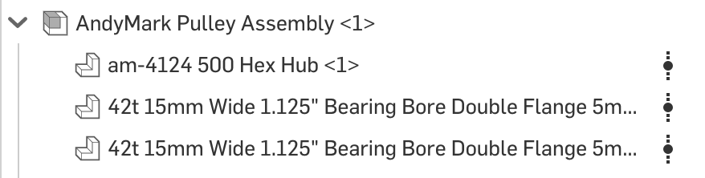
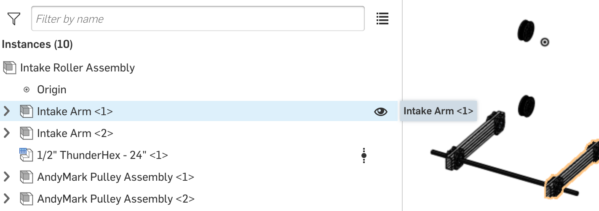

### Onshape Bootcamp B: Robotics Assemblies
# Part 3 - Intake Roller Assembly and Animations

## Overview
In this bootcamp you will create an intake roller used to pick up round game pieces similar to the power cells in the 2020-2021 FRC competition. The animation of the assembly will look as follow at the end of the tutorial:

**Note:** Some of the images and parts shown in screenshots might not exactly match yours when following step by step. Because MKCad is constantly improved, part names, colors, etc might change. It’s also worth noting that this tutorial was originally written using Team 7272 Envirobots part library in Education Enterprise. It was adapted to use MKCad for use by other teams.

## Learning Objectives
*   Using Fastened Mate along a line
*   Mate using Revolute Mate
*   Create a Subassembly
*   Duplicate a Subassembly
*   Use an Offset Fastened Mate in conjunction with other Mate types
*   Animate an assembly

## Steps
### 1. Create a Document
Create a document with the name “Intake Roller Assembly”.

### 2. Delete and Rename Files
Delete the “Part 1” file and rename “Assembly 1” to “Intake Roller Assembly”.

### 3. Insert One 15in 1x2 VersaFrame Tubes
Insert one 15in long 1” x 2” x 0.100”in VersaFrame Aluminum Tube from MKCad “MKCad - Extrusions” document.

### 4. Insert Two VersaBlocks
Insert two “VersaBlock V2” from the “MKCad - Versa” document.

### 5. Mate the VersaBlock using Fasted Mate
Select the Fasted Mate tool and then select the line shown below on the VersaBlock.

**Note:** You will likely need to zoom in very close on the VersaBlock in order to select the correct line. It’s important to select the line and not the rectangular face.

Then select the corner line on the 1x2 Tube shown below to mate the parts. If you have selected the correct lines, you should see the parts mated as follows. You will need to use the Flip and Reorient tools to correctly position the Versablock on the Tube.

When using lines to mate parts, OnShape will mate the parts in the center of each line. For this mate, the VersaBlock’s center is mated at exactly 6.5in of the 15in tube. To change this so that the versablock is at the end of the tube, enter an offset of -5.75in.

Click the green checkbox to save the Mate.

### 6. Mate the Two VersaBlocks

On the real robot the two versa blocks will be connected with screws, one on each side of the 1x2 Tube. To simulate this, we will use the Fastened Mate feature. We want to do this so that the two VersaBlocks move together when one is moved. If we instead used two different fasted mates onto the Tube, the VersaBlocks would move independently of each other on the tube, if the offset is changed in the future.

Select the Fastened Mate tool and then select the screw holes shows below on the versa blocks:

Use the Flip & Reorient Tools to position the parts facing each other in a reflection shown below:

To place the versablock on the other side of the Tube, add a Z offset of exactly -.776in to the mate. You should then see the parts spaced as shown below:

**Note:** How do you calculate the measurement of -.776 in? The section of the part that extends on top of the 1x2 tube is .117in. You can measure it (not while mating) by selecting the line as shown below. Measurements of selected lines appear in the bottom right of the screen. The distance across the 1x2 Tube is 1in, and therefore the equation of the distance between the two mated holes is: -1+(.117*2) = -.776. In OnShape, you could enter this equation as the value and it will be automatically computed for you. Try changing the value with the equation and see it resolve to the same measurement.

### 7. Insert Two 1/2in Hex Flanged Bearings
From the “MKCad - Bearings” document, insert 2x “.5” Hex ID 1.125” OD Flanged Bearing”

### 8. Revolute Mate one Flanged Bearing to one VersaBlocks
You will now use the Revolute Mate, which allows movement of the parts in a circular rotation between the mated selections, which is usually a circle on each of the parts. Select the Revolute Mate tool, select the circle on the Flanged Bearing as shown below, and then the Circle on the Versa block.

**Note:** Only use Revolve Mate one Flanged bearings to a VersaBlock. The other Flanged bearing will be Mated differently in a future step.

**Note:** There are a few circles close to each other on both parts, zoom in close to select the right one.

As usual, use the Flip and Reorient tools to position the flange inside of the versablock. The bearing will stick out a bit like below:

**Note:** You can preview the mate animation while editing a mate, click the Play button before saving the mate to see the bearing rotate 360 degrees and back.

### 9. Fastened Mate the two Flanged Bearings
We want the Flanged Bears to rotate together when animated. Similar to what we did with the VersaBlocks, we will use a fastened mate.

Create a Fastened Mate and select the center of the hexagonal shapes, on both bearings, as the mating points (order doesn’t matter but you may need to negate a measurement in one of the later steps).

Sometimes selecting the correct mating point is hard. Move your mouse around the part until you see the selection as shown below.

You will need to add another offset in the mate in order for the other bearing to appear in the correct place in the versablock. The correct measurement to use is “1.651in” as shown below (the tube is hidden to show the correct alignment of bearings):

Now save the fastened mate after selecting the hex shape on both bearings.

**Note:** Offset measurements like this can usually be obtained by doing a different mate sequence. In this case, you can Fasten Mate both bearings to both Versa Blocks, and then measure the distance between the outside faces of the bearings. You would have to do this in a separate assembly to calculate the distance.

### 10. Organize VersaBlock parts into a Subassembly
An important aspect to keeping an assembly organized is to create sub-assemblies. A sub-assembly is a set of parts originally created in an assembly, but are moved into a sub-assembly. A major advantage to using sub assemblies is to reuse the parts multiple times instead of repeating the steps (inserting and mating) to assemble them. Separating assemblies also helps with version control and parallel editing of documents by students.

After the move, the parts appear in a folder, and a separate assembly tab is created in the current document.

Let’s create a sub assembly for the VersaBlock assembly we just created. Select the 2x VersaBlock parts and 2x Flanged Bearing parts. Don’t select the Tube part, we don’t want to move that to a sub-assembly.

**Note:** It will be very common to use what we created throughout an FRC robot: 2x VersaBlocks that are Mated together with the spacing for a 1in x 2in Tube, also with 2 Flanged Bearings that are Mated together.

**Note:** Your team might want to put this assembly in a separate document and share it across the whole team. You can do this for any assembly by right clicking on the assembly tab and selecting “Move to document…”.

After the parts are moved, Rename the assembly to “VersaBlock Assembly” by Right Clicking on it and using the “Rename” option.

### 11. Duplicate the Subassembly
Now, let’s duplicate the assembly. We want a versablock on each side of the aluminum tube. Click on the insert button. By default the Insert menu shows Part Studios of the Current Document. Click on Assemblies instead, and you should see your “VersaBlock Assembly” assembly listed. Click on it and add a 2nd one. Once inserted you should see two assemblies in the instances pane.

### 12. Mate the 2nd VersaBlock Assembly
The VersaBlock that was just duplicated needs to be mated to the tube. First select the same line we previously used to mate the versablock.

Then select the outer edge of the tube to create a mate. Add a “5.75in” Z offset so that each part is evenly spaced from the edge of the tube.

### 13. Organize Arm Parts into a Subassembly
In the instances tray you should see 3 total parts: 1x Tube and 2x VersaBlock Assembly. Let’s create another sub assembly since we are going to use the assembly twice. Select all 3 parts and then move them to a new subassembly. Name the assembly “Intake Arm”. Your Intake Roller Assembly should now look like as follows, when expanding the Intake Arm sub assembly.

### 14. Duplicate the Subassembly
Next we’re going to add a 2nd intake arm into the Intake Roller Assembly. Instead of using the insert button, we can use copy and paste. Using either keyboard shortcuts or the menu options when right-clicking, duplicate the assembly. Copy and Paste is easier than using the insert menu to duplicate any parts or assemblies that are already in the current assembly.

### 15. Insert a Hex Shaft and Mate to Intake Arms
Next, We will insert a 22in Hex Shaft from the “MKCad - Shafts” document. The part to use is “Vex Hex / ThunderHex” with a configured length of 22in.

Next, using Fastened Mate, mate the end of the hex shaft to the hex opening on the Flanged bearing on one of the arms.

Make sure to flip and reorient the shaft so that the hex shapes align and the shaft is sticking out in this direction:

Add a 3in Z offset so that the shaft sticks out of the arm. Save the mate.

Next, complete the same mate process to attach the other arm. This time, mate the flanged bearing on the reverse side of the arm to the other end of the shaft. As always, the order of selected parts matters. Also, selecting the wrong Flanged will result in unequal lengths when comparing both arms. Think through which parts to select and in what order in order to make is symmetrical. As shown below when viewing from the top:

### 16. Create AndyMark Pulley Assembly
Our intake arm assembly will turn using a pulley and belt system that will be fully assembled by the end of the Bootcamp series. Let’s assemble a pulley using 3 AndyMark Parts.

Insert 1x “am-4124 500 Hex Hub” from the “MKCad - Hubs” document.

Then insert 1x “42T 15MM Wide 1.125in Pulley” from the “MKCad - Pulleys” document. The full name is shown below. This is AndyMark part number  am-2234.

Now use the fastened mate tool to connect the Pulley to the hex hub. As shown below, select one of the six holes of the pulley to connect to one of the six holes of the hub.

Save the mate. You will notice that the 2nd half of the pulley will break away from the other half. This is because the mating of the two halves is optional, you could instead add spacers between the two halves (using AndyMark part number am-2813). In this tutorial, we will not use spacers, so lets mate the two halves. Use the fastened mate tool again to connect the two halves as shown below.

Once the mate is created, You should have a part that looks like the following, it is a pulley that will drive a 1/2in hex shaft that is through it.

Make another sub-assembly for this. It will be a common component. Move the 3 parts to a sub assembly and name it “AndyMark Pulley Assembly”

### 17. Duplicate the AndyMark Assembly
Copy and paste the AndyMark Assembly so that you have two of them. Your entire assembly should then have a structure similar to the following.

### 18. Insert 3x Compliant Wheels
Now insert 3x of the “4in OD 1/2in Hex Bore Compliant Wheels” into your assembly. They are located in the “MKCad - Wheels” document.

### 19. Insert Left and Right Mecanum Wheels
One Mechanum wheel will be mounted on each end of the intake roller shaft. Insert both 1x “4in Right Vexpro Mecanum Wheel” and 1x “4in Left Vexpro Mecanum Wheel””.

### 20. Mate the Components to the shaft
Now mate the 2x Mechanum Wheels, 3x Compliant Wheels, and 2x AndyMark Pulley Assembly to the hex shaft. Use the Fastened Mate tool to connect each to the shaft. Using the following as an assembly guide with offsets from the left or right of the arm. All of the components should look symmetrical after being placed.

<table>
  <tr>
   <td>
<strong>Item</strong>
   </td>
   <td><strong>Z Offset</strong>
   </td>
  </tr>
  <tr>
   <td>Left Mecanum Wheel
   </td>
   <td>2.5 in
   </td>
  </tr>
  <tr>
   <td>Compliant Wheel 1
   </td>
   <td>7 in
   </td>
  </tr>
  <tr>
   <td>AndyMark Pulley 1
   </td>
   <td>9.5 in
   </td>
  </tr>
  <tr>
   <td>Compliant Wheel 2
   </td>
   <td>12.5 in
   </td>
  </tr>
  <tr>
   <td>AndyMark Pulley 2
   </td>
   <td>15.5 in
   </td>
  </tr>
  <tr>
   <td>Compliant Wheel 3
   </td>
   <td>18 in
   </td>
  </tr>
  <tr>
   <td>Right Mecanum Wheel
   </td>
   <td>23.75 in
   </td>
  </tr>
</table>

### 21. Animate the Final Assembly
Now it’s time to test out your work! You can use the existing rotate mates that were created inside of the VersaBlock Assembly for animation. Open one of the VersaBlock Assembly folders on the left tray and find the Revolute Mate. You should select one of the four VersaBlock Assemblies that is part of the shaft assembly. The full folder path to traverse is “Intake Roller Assembly” - > “Intake Arm” -> “VersaBlock Assembly” -> “Mate Features”. When you hover over a mate, it will show you the parts that are associated with the mate which makes it easier to select the correct one.

If you animate the mate, all parts mated to the shaft should rotate. Right click on the mate and choose Animate...

A dialog will appear with many options. Change Steps to “100” to make it spin faster, then click the Play button. You should see all of the parts Fastened Mated to the shaft spin along with the shaft and the Flanged Bearings. Because all of the Flanged Bearings are using Revolute Mate to the VersaBlocks, they spin inside of the VersaBlock instead of rotating the VersaBlocks and VersaFrame Tube.

**Note:** If your animation is not working correctly, such as the tubes are rotating instead or in addition to the Tubes, some mate was configured incorrectly. Remember that the selection order in mating matters for animations too. In the last bootcamp we mentioned that the 1st selected part moves toward the 2nd selected part. The selection order also matters for animations, the 1st selected part will always animate along the line that was selected and the 2nd selected part will remain stationary. It’s also possible that you accidentally used a Fasted Mate instead of a Revolute Mate between the Flanged Bearings and VersaBlocks.