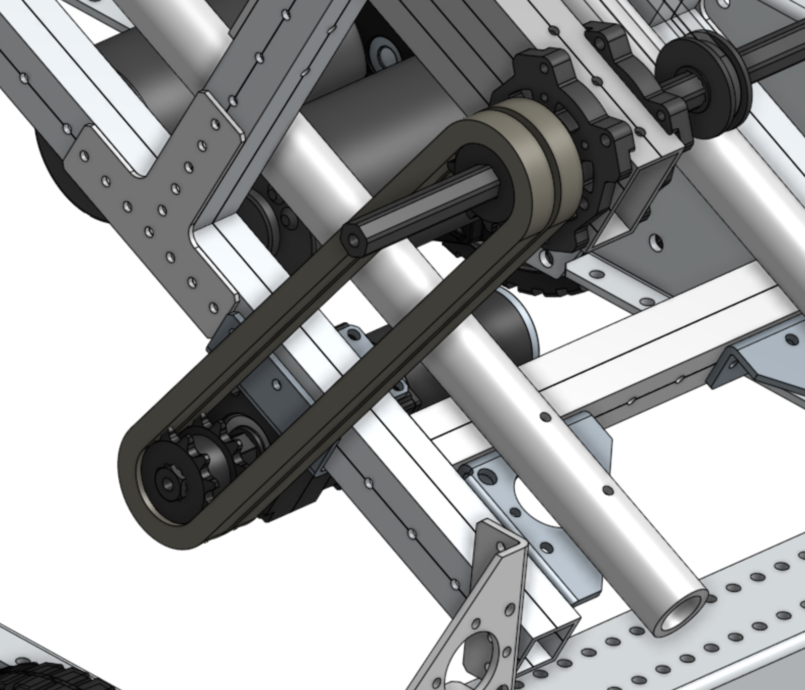
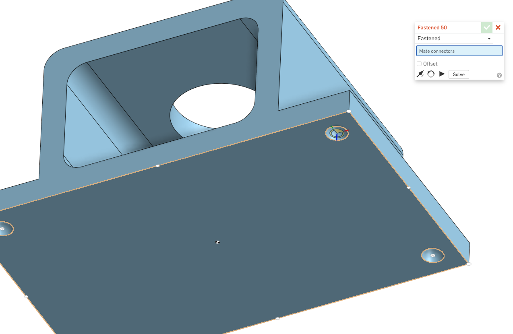

### Onshape Bootcamp B: Robotics Assemblies
# Part 4 - Ramp Assembly
In this bootcamp you will create a ramp assembly using the chassis with support structure and the belt parts you created earlier. The ramp will be designed to carry power cells that are picked up by the intake roller and place them into the lower power port. The design of the ramp will look like this when completed:

## Learning Objectives
*   Inserting parts/assemblies from other documents created by you.
*   Mating tubing, belts, chain in an assembly
*   Using Configurable VersaPlanetary Gearbox in MKCad

## Steps
### 1. Open Document
Open the document named “2020 Robot” in OnShape that you previously created in the bootcamp with the ramp structure built on top of the AndyMark Chassis.

### 2. Add Ramp Supports
Insert 2x corner gussets from “MKCad - Versa” public document.

Insert 1x 8.5in 1x1 VersaFrame Tube from the “MKCad - Extrusions” public document.

Join the parts using the Fastened Mate tool so that the corners of the gusset are flush with the ends of the tube. To do this, you will mate the 1st hole closest to the center of the first corner gusset to the 1st hole on the tube. And the 2nd hole closest to the center of the second gusset to the 1st hole on the other side of the tube.

Move all 3 parts into a subassembly and name it “Ramp Bottom Support Assembly”. Duplicate the sub assembly so that there are 2x of them.

Add the bottom supports to the chassis support structure by using Fastened Mate to join the furthest hole on the corner gusset to the 1st hole of the ramp as shown below.

As usual, use the flip and reorient tools to match the orientation of the assemblies shown.

Next add the 2nd support to the top of the ramp, using again the furthest hole of the corner gusset (select the opposite corner since the part has to be mounted facing down) to the last hole of the ramp.

### 3. Add Ramp PVC Tubes
In a previous tutorial you created a 1in diameter PVC tube with holes drilled into it. Insert 2x of the part now from your “Customized Robot Parts” document. Again, the best way to find it is to search for “Created by me” in the insert dialog.

### 4. Mate the PVC Tubes to Ramp
Using the Fastened Mate tool, select the first screw hole of the PVC tube (the hole spaced 2in from the edge). And then select the hole on the corner gusset pictured below.

Do this for both PVC tubes and your ramp should then have two bottom guides for the power cells to move through. If you inspect the drill holes of the PVC, they should align correctly with holes on all corner gussets, as well.

### 5. Add 4x VersaBlock Assemblies
Our ramp will function with a polycord pulley assembly that is mounted along the 1x2 VersaFrame Tube. To start this assembly, insert 4x of the VersaBlock Assemblies. They should exist in your “Intake Roller Assembly” document.

Mount 2 of the assemblies to the edge of one 1x2 tube on the robot. Following the same steps as the Intake Roller step by step guide, fix the versablocks on all four ends of the 1x2s, trying to get the blocks as close to the edge as possible. The Z offsets for both blocks should be 15.25in.

Repeat with the other side to add the other 2x VersaBlocks.

### 6. Add 2x 1/2in Hex Shafts
Next, we will add 2x 1/2in Hex Shafts. Insert 1x 12in ThunderHex from the “MKCad - Shafts” public document.

Then Fastened Mate it to one of the Flanged Bearings at top of the ramp, with a Z offset of .5in so that it is about evenly spaced on the robot.

Then insert a 19in Shaft, again from “MKCad - Shafts” public document.

Use Fastened Mate to attach the shaft to the bottom of the ramp. Use a 4in offset to center the shaft on the robot.

### 7. Add 4x WCP PolyCord Pulleys

Insert 4x WCP PolyCord Pulleys (single version) from the “MKCad - Pulleys” document.

Use Fastened Mate to add all 4 WCP Pulleys to the Robot, with the following Z offsets for each one.

<table>
  <tr>
   <td>
1st Bottom Pulley
   </td>
   <td>7.25 in
   </td>
  </tr>
  <tr>
   <td>2nd Bottom Pulley
   </td>
   <td>11.5 in
   </td>
  </tr>
  <tr>
   <td>1st Top Pulley
   </td>
   <td>3.75 in
   </td>
  </tr>
  <tr>
   <td>2nd Top Pulley
   </td>
   <td>8 in
   </td>
  </tr>
</table>

Example of the 2nd Top Pulley Mate:

Next, add 2x of the PolyCord Loop that was crafted in Customized Robot Parts.

Use the Fastened Mate tool to join the loop to one of the WCP Pulleys at the bottom of the ramp. Select the center mate connector on both parts as shown below.

**Note:** Revolute Mate doesn’t currently work with the belt feature script. There isn’t a way to animate the rotation of it like wheels & shafts.

Set an “Rotate about Z” offset of 47.5 deg. Your offset might vary based on the mating order / direction. Use the side view of the robot to make sure the belt is aligned.

Mate the 2nd PolyCord loop to the 2nd WCP Pulley. Once completed, your robot should have two PolyCord Pulley assemblies.

### 8. Add Motor Assembly
Next we will add a motor, gearbox, bracket, and sprockets that will power the ramp and intake roller.

First, insert a “Versaframe Versaplanetary Side Mount” bracket from the “MKCad - Versa” document.

Select the first hole in on the left of the face with the 3 holes, as shown. Select the hole on the inside of the part, not on the outside.

Then select the first hole to the right of the T gusset on the lower bar of the ramp.

If mated correctly, the bracket should appear on the inside the ramp between the T gusset and 1x1 bottom support, as shown.

Next, insert a gearbox from the “MKCad - Configurable Versaplanetary” document. Switch to the assembly view and configure the “Configurable VersaPlanetary” assembly. Use the configuration options shown below.

**Note:** After clicking generate, click on the Assembly title to insert one gearbox assembly. This is a little different than generating configurable parts, where a part is shown below the generate button.

 Use the fastened mate tool again to connect the gearbox to the bracket as shown below.

### 9. Add Sprockets
Next, insert 2x “12t 35 Chain Steel Double Sprocket” from the “MKCad - Sprockets” document.

Use Fastened Mate to attach the sprockets to the gearbox and the shaft above it. Use the top view to align the sprockets as shown below. Use Z offsets of -.1in for the gearbox shaft and -2.75in on the upper shaft.

### 10. Add Chain
Insert 2x “Ramp Chain” parts from your “Customized Robot Parts” document.

### 11. Fastened Mate to the Sprockets
Use the fastened mate tool to attach the chain loop to the lower sprockets (the one connected to the VersaPlanetary gearbox). Use the same method to attach the chain as with the PolyCord loop. The chain won’t be exactly centered on the sprocket teeth.

Do the same procedure for the 2nd chain loop onto the second set of teeth of the double sprocket.

### 12. Add Intake Roller
Insert the “Intake Roller Assembly” that you created in your “Intake Roller Assembly” document.

Use the Fastened Mate tool to connect the roller to the hex shaft at the bottom of the ramp. Select the outer flanged bearing on the left side of the intake roller and connect it of the left end of the shaft (the same side that has chain connected to it.

Then add -.5in Z offset to center the intake roller on the robot.

### 13. Insert AndyMark Pulley Assemblies
Now insert 2x “AndyMark Pulley Assembly” from your “Intake Roller Assembly” document.

A single motor and VersaPlanetary gearbox will power the ramp shaft, which will control both the intake roller and PolyCord pulley ramp assembly. Use the Fastened Mate tool to attach the pulleys to the lower ramp shaft.

Use a -5.9in Z Offset to align the Pulley to the same position that is vertical to the pulley on the intake roller.

Do the same with the other pulley and use a -11.85in offset of Xin to position it vertically with the 2nd pulley on the intake roller.

### 14. Insert Intake Roller Belt Loop

Insert 2x “Intake Roller Belt Loop” from your “Customized Robot Parts” document.

Using Fastened Mate, join the outer edge of the belt with the outer edge of the pulley as shown below. Use a .125in offset to center the belt onto the pulley assembly.

Next, add a Rotate about Z offset to the belt to make it parallel to the intake roller. Use a 22.5deg angle, which may differ for you depending on the mate order selection.

Do the same procedure to the 2nd belt. Now the ramp is fully assembled.

### 15. Attach RSL Mount
You created a Robot Signal Light earlier in the bootcamp, lets insert that now from your “RSL Mounts” document.

Mate the part to chassis using the fastened mate tool and the screw holes shown below.

Then Insert an “Robot Signal Light” from the “MKCad - Electronics” document.

Use the Fastened Mate tool again to connect it to the mount.

After mounting the RSL, the OnShape Tutorial is complete!
