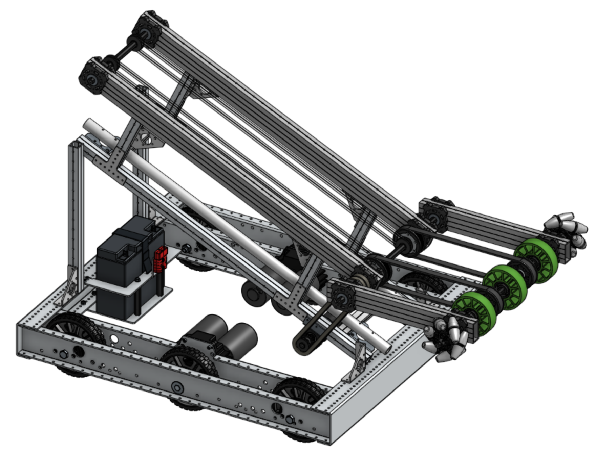

# Overview
Welcome to the OnShape Bootcamp series! This is a collaborative effort to provide learning to students with learning activities for OnShape and is specific to the FIRST Robotics Competition.

The tutorial consists of parts which can be handed out as progressive assignments. All sections of the tutorial build on themselves and it is recommended that students start at the beginning.

This tutorial teaches you how to construct a robot assembly in OnShape using standard FIRST Robotics Competition parts including the AndyMark Kit of Parts (KoP) Chassis and Vex Pro structural components. It utilizes the MKCad instead of importing your own STEP files into OnShape.

At the end of this tutorial you will have built a robot with a ramp support structure. The design was adapted from Team 7272 Envirobots 2020-2021 Competition robot, which picked up power cells of the ground and carried power cells into the lower power port.

# Tutorials
## OnShape Bootcamp A: Part Creation
- [Part 1 - Intro to OnShape](Bootcamp-A/Part-1/README.md)
- Part 2 - Using Sketch and Extrude to Create a Part
- Part 3 - Customizing an FRC Part
- Part 4 - Creating Custom Tubes, Belts, and Chain
- Part 5 - Creating a Robot Signal Light (RSL) Mount

## OnShape Bootcamp B: Robotic Assemblies
- Part 1 - Using MKCAD
- Part 2 - Create a Chassis & Support Assembly
- Part 3 - Intake Roller Assembly and Animations
- Part 4 - Ramp Assembly